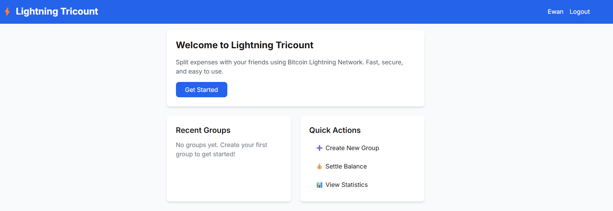
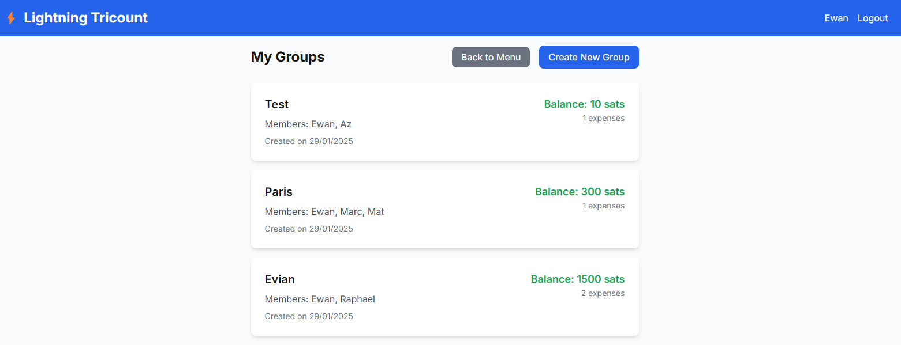
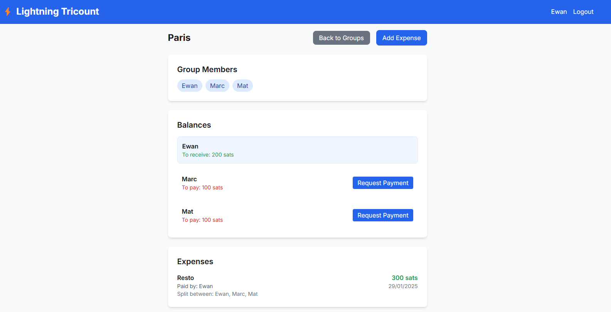
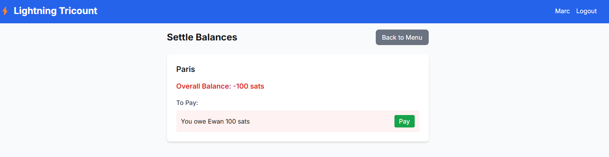

# ⚡ Lightning Tricount

A modern expense sharing app powered by Bitcoin Lightning Network payments. Split bills with friends and settle debts instantly using Lightning payments.



## 🌟 Features

### Group Management
- Create expense groups with friends
- Add multiple members to each group
- Track expenses and balances in real-time
- View detailed expense history

### Expense Tracking
- Add expenses with descriptions
- Split expenses equally or custom amounts
- Track who paid what and who owes whom
- View running balances for all members

### ⚡ Lightning Payments
- Request payments directly through the app
- Instant settlements using Lightning Network
- Secure and low-fee transactions
- Real-time payment status updates

## 📱 Screenshots

### Dashboard & Groups

*Main dashboard showing all your groups and total balances*

### Group Details

*Detailed view of a group showing expenses and balances*

### Payment Flow

*Lightning payment request and settlement process*

## 🛠 Technology Stack

- **Frontend**:
  - Next.js 14 (App Router)
  - TypeScript
  - Tailwind CSS
  - React Context for state management

- **Backend**:
  - Node.js with Express
  - MongoDB for data storage
  - LND (Lightning Network Daemon)
  - Lightning Service for payment processing

## 🚀 Getting Started

### Prerequisites
- Node.js 18+
- MongoDB
- LND node (for Lightning payments)

### Installation

1. Clone the repository:
```bash
git clone https://github.com/yourusername/lightning-tricount.git
cd lightning-tricount
```

2. Install dependencies:
```bash
# Install frontend dependencies
cd frontend
npm install

# Install backend dependencies
cd ../backend
npm install
```

3. Configure environment variables:

Frontend (.env.local):
```env
NEXT_PUBLIC_API_URL=http://localhost:3000
```

Backend (.env):
```env
MONGODB_URI=your_mongodb_uri
LND_HOST=localhost:10009
LND_MACAROON=your_macaroon_hex
LND_CERT=your_tls_cert_base64
```

4. Start the development servers:

```bash
# Start frontend (from frontend directory)
npm run dev

# Start backend (from backend directory)
npm run dev
```

## 💡 Usage

1. **Create a Group**
   - Click "Create New Group"
   - Add group name and members
   - Members are added using their usernames

2. **Add Expenses**
   - In a group, click "Add Expense"
   - Enter amount, description, and who paid
   - Select members to split between

3. **Request Payments**
   - View balances in group details
   - Click "Request Payment" for amounts owed to you
   - Recipients will see payment requests

4. **Make Payments**
   - Click "Pay" on received payment requests
   - Confirm Lightning payment
   - Payment status updates automatically

## ⚡ Lightning Network Setup

1. Install and configure LND:
```bash
# Install LND
curl https://raw.githubusercontent.com/lightningnetwork/lnd/master/scripts/install.sh | bash

# Start LND
lnd
```

2. Get your credentials:
```bash
# Get macaroon (hex format)
xxd -ps -u -c 1000 ~/.lnd/data/chain/bitcoin/mainnet/admin.macaroon

# Get TLS cert (base64 format)
base64 -w0 ~/.lnd/tls.cert
```

3. Update your .env with these credentials

## 🤝 Contributing

Contributions are welcome! Please feel free to submit a Pull Request.

## 📄 License

This project is licensed under the MIT License - see the [LICENSE](LICENSE) file for details.

## 🙏 Acknowledgments

- [LND](https://github.com/lightningnetwork/lnd) for Lightning Network implementation
- [Next.js](https://nextjs.org) for the frontend framework
- [Tailwind CSS](https://tailwindcss.com) for styling 